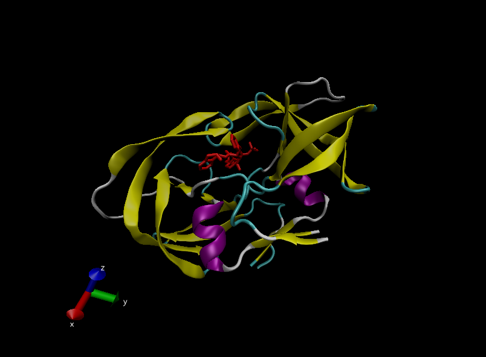
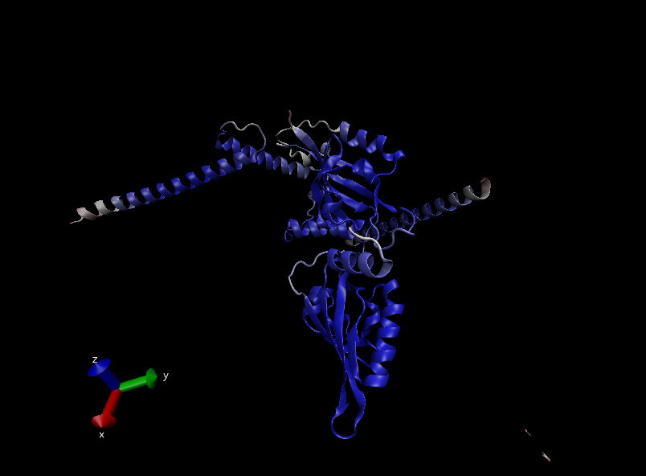

# 1. Intro to the PDB database

```{r}
pdb.stats <- read.csv("Data_Export_Summary.csv", row.names = 1)
View(pdb.stats)
```

## Q1. What percentage of structures in the PDB are solved by X-Ray and Electron

## Microscopy.

```{r}
# for x-ray:
sum(pdb.stats$X.ray) / sum(pdb.stats$Total) * 100

# for EM:
sum(pdb.stats$EM) / sum(pdb.stats$Total) * 100

# alternatively, use colSums()
tot.method <- colSums(pdb.stats)
signif(tot.method / tot.method["Total"] * 100, 3)
```

87.2% are solved by X-ray, 5.35% are solved by EM.

## Q2. What proportion of structures in the PDB are protein?

```{r}
signif(pdb.stats$Total[1] / sum(pdb.stats$Total), 3) * 100
```

87.3% of structures are proteins.

## Q3. Type HIV in the PDB website search box on the home page and determine how

## many HIV-1 protease structures are in the current PDB?

There are 836 protease structures.

# 2. Visualizing the HIV-1 protease structure



## Bio3D package for bioinformatics

```{r}
# install.packages("bio3d")
library(bio3d)
pdb <- read.pdb("1hsg")
pdb
```

```{r}
pdb$atom
```

## Q4. Water molecules normally have 3 atoms. Why do we see just one atom per water molecule in this structure?

Due to the limitations of x-ray diffraction, the resolution of the structures are limited and only the oxygen atom can be seen from a water molecule.

## Q5. There is a conserved water molecule in the binding site. Can you identify this water molecule? What residue number does this water molecule have (see note below)?

HOH308:0.

## Q6. As you have hopefully observed HIV protease is a homodimer (i.e. it is composed of two identical chains). With the aid of the graphic display and the sequence viewer extension can you identify secondary structure elements that are likely to only form in the dimer rather than the monomer?

The hollow space in the center of the homodimer where the ligand is found.

# 3. Introduction to Bio3D in R

## Q7: How many amino acid residues are there in this pdb object?

There are 198.

## Q8: Name one of the two non-protein residues?

MK1

## Q9: How many protein chains are in this structure?

There are 2.

# 4. Comparative structure analysis of Adenylate Kinase

## Q10. Which of the packages above is found only on BioConductor and not CRAN?

msa

## Q11. Which of the above packages is not found on BioConductor or CRAN?:

bio3d-view

## Q12. True or False? Functions from the devtools package can be used to install packages from GitHub and BitBucket?

TRUE

```{r}
# install.packages("httr")
aa <- get.seq("1ake_A")
aa
```

## Q13. How many amino acids are in this sequence, i.e. how long is this sequence?

There are 214 amino acids.

```{r}
# Blast or hmmer search 
b <- blast.pdb(aa)

# Plot a summary of search results
hits <- plot(b)

# List out some 'top hits'
head(hits$pdb.id)
hits$pdb.id

# Download releated PDB files
files <- get.pdb(hits$pdb.id, path="pdbs", split=TRUE, gzip=TRUE)
```

# Align and superpose structures

```{r}
# Align releated PDBs
pdbs <- pdbaln(files, fit = TRUE)#, exefile="msa")

# Vector containing PDB codes for figure axis
ids <- basename.pdb(pdbs$id)

# Draw schematic alignment
plot(pdbs, labels=ids)
```

## PCA

```{r}
# Perform PCA
pc.xray <- pca(pdbs)
plot(pc.xray)

# Calculate RMSD
rd <- rmsd(pdbs)

# Structure-based clustering
hc.rd <- hclust(dist(rd))
grps.rd <- cutree(hc.rd, k=3)

plot(pc.xray, 1:2, col="grey50", bg=grps.rd, pch=21, cex=1)
```

# 6. Normal mode analysis

```{r}
pdb <- read.pdb("1ake")
pdb

# trim to chain A only
chain <- trim.pdb(pdb, chain = "A")
chain

# NMA of all structures
modes <- nma(pdbs)
plot(modes, pdbs, col=grps.rd)

# NMA of a chain
modes <- nma(chain)
mktrj.nma(modes, mode = 7, file = "mode_7.pdb")
```

# AlphaFold structure of protein of interest (from project)

 Only parts where beta \> 50 are shown.

## Q14. What do you note about this plot? Are the black and colored lines similar or different? Where do you think they differ most and why?
The black lines are noticeably lower than the colored lines at residues 50-60 and 130-150. This means that the protein structures represented by the colored lines are significantly more flexible at those positions compared to the proteins represented by the black lines.